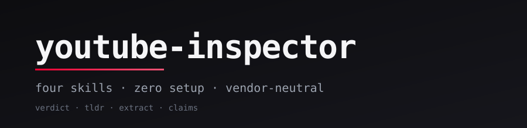

<div align="center">



# youtube-inspector

[](#install)
[](#license)
[](#install)
[](#how-it-works)

</div>

Four [agent skills](https://skills.sh) that turn any YouTube URL into a watch-decision, a neutral summary, an artifact list, or a claim inventory — vendor-neutral, no API keys, with verbatim transcript citations on every flag and claim.

- **Pre-watch verdict** — WATCH / OKAY / SKIP with a 0–10 score, best-minutes range, and who-should-watch / who-should-skip split.
- **Section-by-section TL;DR** — 3–4 sentence summary, per-section breakdown, skippable-segment markers for pitches and outros.
- **Categorized artifact extraction** — links, code, books, tools, and people referenced in the video, each with timestamp and verbatim mention.
- **Research-grade claim inventory** — concrete claims, vague claims, evidence shown, and pitches, every entry timestamped and quoted verbatim.
- **No hallucinated criticism** — every flag, claim, and reference cites a verbatim transcript quote with timestamp; if the model can't quote it, it can't write it.
- **Shared transcript cache** — all four skills hit the same `~/youtube-reports/.cache/{video_id}.json`. Run any combination on the same video; the network call happens once.

## Sample Output

```
━━━━━━━━━━━━━━━━━━━━━━━━━━━━━━━━━━━━━━━━━━━━━━━━━━━━━━
  ⚠️  OKAY  ·  5/10  ·  Gap MEDIUM
━━━━━━━━━━━━━━━━━━━━━━━━━━━━━━━━━━━━━━━━━━━━━━━━━━━━━━

  ⏩ A short pitch wrapped around three real numbers and a vague stack
     reveal. Useful as a beginner-level intro to digital-product income;
     the actual workflow is deferred to upcoming videos.

━━━━━━━━━━━━━━━━━━━━━━━━━━━━━━━━━━━━━━━━━━━━━━━━━━━━━━

  The Lazy Way I Make Money With AI (2026)
  Travis Nicholson  ·  3:48

  🎯 Best minutes   [1:10–2:25] — Stack reveal and revenue progression
  📊 Substance      29 concrete · 11 vague · 4 evidence
  👥 Watch if       Beginners curious about Canva + ChatGPT + Gumroad
  👥 Skip if        Viewers wanting an actual step-by-step workflow

  🚩 Flags (6)
     [0:02] "I've made over $26,000…"          — Headline revenue, no proof
     [0:04] "I work maybe 1 hour per week…"    — "Lazy" claim asserted only

  📄 ~/youtube-reports/2026-05-05-the-lazy-way-...-n0phBDPz8z0.md
```

Saved to `~/youtube-reports/<date>-<slug>-<video_id>.md`. Same shape across all four skills (verdict adds `WATCH/OKAY/SKIP`; tldr/extract/claims swap in their own dashboards).

## Install

```bash
# 1. Install Python deps once (skills.sh skills don't bundle pip deps)
pipx install yt-dlp youtube-transcript-api
# Or, if you don't have pipx:
pip install --user yt-dlp youtube-transcript-api

# 2. Install all four skills
npx skills add nishilbhave/youtube-inspector
```

That's it. No API keys, no env vars, no config files — the host agent's existing model subscription does the LLM work, and the only system requirement is **Python 3.11+**.

Each skill is **self-contained**. `npx skills add` ships `SKILL.md` plus `scripts/` (fetch, segments, cache, doctor — and `dashboard.py` for verdict) and `prompts/` to the host's skill directory (e.g. `~/.claude/skills/youtube-verdict/`). No working-directory assumptions: SKILL.md uses `<SKILL_DIR>`-prefixed paths so the skill works wherever your shell happens to be when you invoke it.

Manage:

```bash
npx skills update nishilbhave/youtube-inspector
npx skills remove nishilbhave/youtube-inspector
```

Each skill runs `scripts/doctor.py` automatically before its first fetch (Step 1.5 of every SKILL.md). If your Python environment is missing `yt-dlp` or `youtube-transcript-api`, the skill stops with the exact `pipx install` command to copy-paste — no mid-run `ModuleNotFoundError` surprises.

## Skills

- **`youtube-verdict`** — *"is this worth watching?"* → WATCH / OKAY / SKIP, 0–10 score, best-minutes range, substance density, who-should-watch / who-should-skip split, every flag a timestamped verbatim quote.
- **`youtube-summary`** — *"summarize this video"* / *"tl;dr"* → 3–4 sentence TL;DR, section-by-section breakdown, top takeaways, skippable-section markers. Factual and neutral — never recommends watching or skipping.
- **`youtube-extract`** — *"what tools / books / links did they mention?"* → categorized list of links, code, books, tools, and people, each with timestamp and verbatim mention.
- **`youtube-claims`** — *"list every claim this video makes"* → research-grade chronological inventory of concrete claims, vague claims, evidence shown, and pitches, with timestamps and verbatim quotes. V1 is inventory-only; no external verification.

## How It Works

Three-pass pipeline shared across all four skills:

- **Pass 1 — structure (shared by all 4)**: `python3 scripts/fetch.py <url> --cache` pulls metadata + transcript and writes `~/youtube-reports/.cache/{video_id}.json`. The host agent then runs `prompts/extract_structure.md` once over the transcript to segment it into hook / content / pitch / outro with timestamps. Output is cached at `{video_id}-pass1.json` and reused by every skill that runs on the same video.
- **Pass 2 — per-skill inventory (partial sharing)**: `python3 scripts/segments.py <video_id> <start> <end>` slices the cached transcript per Pass 1 section, so the host agent's LLM only sees one section at a time. `youtube-verdict` and `youtube-claims` share `prompts/inventory_claims.md` and the same `{video_id}-pass2.json` cache; `youtube-summary` uses `prompts/summarize_sections.md`; `youtube-extract` uses `prompts/extract_artifacts.md`.
- **Pass 3 — per-skill synthesis**: each skill's own prompt (`prompts/generate_verdict.md`, `prompts/generate_summary.md`, `prompts/generate_extract.md`, `prompts/generate_claims.md`) takes Pass 1 + Pass 2 + a small metadata subset and produces the final report — the transcript itself is never reloaded for Pass 3.

**Cache protocol** is locked by `scripts/cache.py`: SHA-256 of the prompt file's raw bytes (`prompt_hash`) plus SHA-256 of the canonical-JSON form of the inputs (`inputs_hash`). Same logical input on any host produces the same digest; edits to a prompt or transcript automatically invalidate downstream passes. Unit tests in `tests/test_cache.py` lock the canonicalization (`sort_keys=True`, compact separators, UTF-8).

**Vendor-neutral by construction**: no Anthropic, OpenAI, or other vendor SDK is imported anywhere in the repo. The host agent's existing LLM and auth do every model call. Skills work the same on Claude Code, Cursor, Antigravity, Codex, and any other agent that follows the [skills.sh](https://skills.sh) convention.

## Roadmap

- **`youtube-batch`** — apply any of the above to N videos at once. Planned for V2; pending cross-platform validation of V1.

## Local development

```bash
python3 -m venv .venv
source .venv/bin/activate
pip install -e ".[dev]"

# Pre-flight: confirm yt-dlp + youtube-transcript-api importable
python3 scripts/doctor.py

# Test suite (fetch, segments, cache, slug, doctor)
pytest -q
```

Architecture spec: [`docs/yt-worth-it-plan.md`](./docs/yt-worth-it-plan.md). Publish prep tracker: [`docs/PUBLISH.md`](./docs/PUBLISH.md). Phase tracker (Phases 0–3 complete; Phase 4 superseded by `PUBLISH.md`): [`docs/PHASES.md`](./docs/PHASES.md).

## License

MIT.
